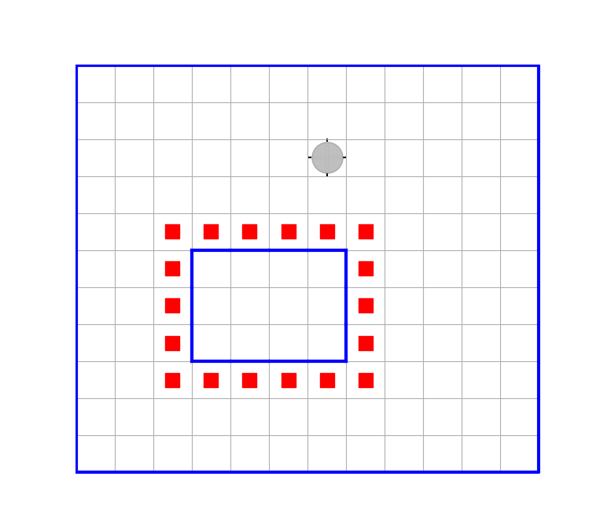
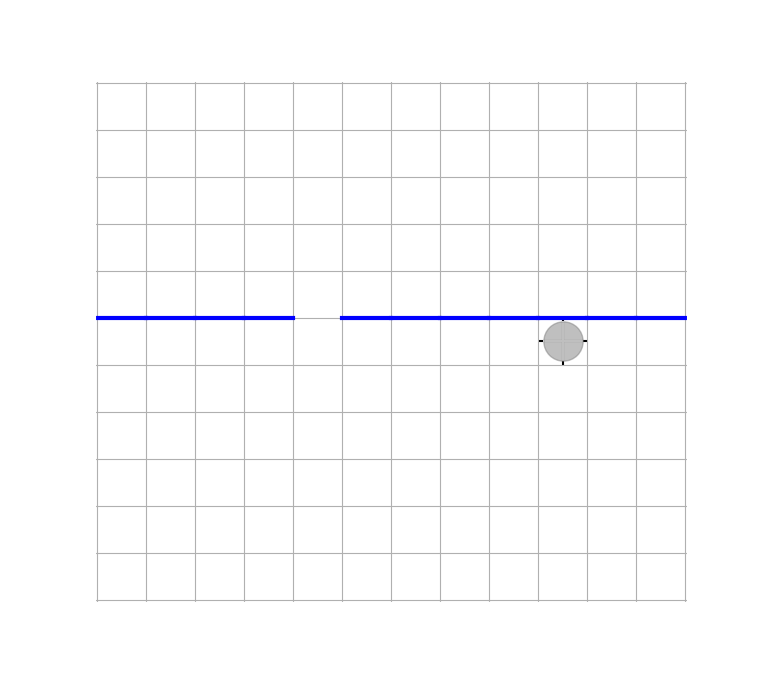
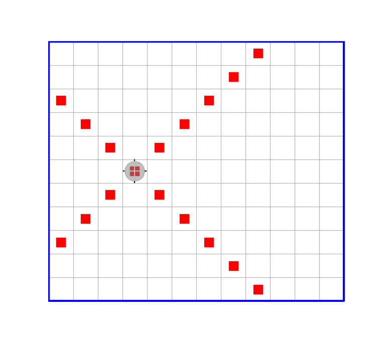

# Практическое занятие 1

**Тема занятия: технология проектирования "сверху вниз"**

Содержание этой технологии было разъяснено [здесь](https://github.com/Vibof/Robot/blob/master/example.md).

Для её практического усвоения продолжим решение задач.

## Задача 2
(задача 1 была разобрана на лекции) 

ДАНО: Робот - в произвольной клетке поля (без внутренних перегородок и маркеров)

РЕЗУЛЬТАТ: Робот - в исходном положении, и все клетки по периметру внешней рамки промакированы

**Решение**

```julia
Декомпозиция задачи на уровне псевдокода

function mark_frame_perimetr!(r::Robot)
    дойти до самого Юга и вернуть сделанное число шагов
    дойти до самого Запада и вернуть сделанное число шагов
    #УТВ: Робот - в Юго-Западном углу

    for sidе - перебор всех 4-х сторон горизонта в ПРАВИЛЬНОМ порядке
        маркировать все клетки, кроме первой, в напраленнии side 
    end 
    #УТВ: По всему периметру прямоугольника стоят маркеры

    сделать уже известное число шагов на Север
    сделать уже известное число шагов на Восток
    #УТВ: Робот - в исходном положении
end

Вот соответствующий код на Julia

function mark_frame_perimetr!(r::Robot)
    num_vert = moves!(r, Sud)
    num_hor = moves!(r, West)
    #УТВ: Робот - в Юго-Западном углу

    for sidе in (HorizonSide(i) i=0:3) # (Nord, West, Sud, Ost)
        putmarkers!(r, side) 
    end 
    #УТВ: По всему периметру стоят маркеры

    moves!(r, Nord, num_vert)
    moves!(r, Ost, num_hor)
    #УТВ: Робот - в исходном положении
end

Реализация вспомогателных функций

function moves!(r::Robot,side::HorizonSide)
    num_steps=0
    while isborder(r,side)==false
        move!(r,side)
        num_steps+=1
    end
    return num_steps
end

function moves!(r::Robot,side::HorizonSide,num_steps::Int)
    for _ in 1:numsteps # символ "_" заменяет фактически не используемую переменную
        move!(r,side)
    end
end

```
Последние две функции имют одинаковые имена, но различаются количеством своих аргументов, поэтому `Julia` сумеет разобраться какую из них и когда надо вызывать. Это свойство языка называется **множественной диспетчеризацией**. Далеко не все языки программирования обладают этим свойством, например, в `Python` так сделать было бы нельзя.

Следующая функция уже была нами реализована при решении самой первой задачи (см. пример, разбиравшийся на 1-ой леции). И мы могли бы этим сейчас воспользоваться, но для этого надо было бы эту функцию сначала поместить в отдельный библиотечный файл, в котрый мы могли бы помещать также и другие универсально полезные функции. А затем этот библиотечный файл можно было бы использовать в других файлах с помощью функции `include`. Но пока еще мы этого не сделали, то нам придется написать ее повторно (хотя, конечно, это не правильно).

```Julia
function putmarkers!(r::Robot, side::HorizonSide)
    while isborder(r,side)==false
        move!(r,side)
        putmarker!(r)
    end
end
----------------------------------------

Все эти определения должны быть помещены в отдельный файл (в этом файле мы и должны были сразу и писать их). Пусть этот файл называется "example-1.jl"

Тогда, что бы приступить к отладке программы, необходимо поместить все наши определения в пространство имен REPL. Для этого из REPL следует выполнить функцию

julia> include("examle-1.jl")

Предвартельно, конечно, мы должны были сделать

julia> include("robot.jl")
julia> r=Robot(animate=true)
```

После этого уже следует приступить к отладке программы. Для этого лучше всего придерживаться технологии отладки "снизу вверх", суть которой была изложена [здесь](https://github.com/Vibof/Robot/blob/master/example.md).


## Задача 3

ДАНО: На ограниченном внешней прямоугольной рамкой поле имеется ровно одна внутренняя перегородка в форме прямоугольника. Робот - в произвольной клетке поля между внешней и внутренней перегородками.

РЕЗУЛЬТАТ: Робот - в исходном положении и по всему периметру внутренней перегородки поставлены маркеры.



**Решение**

```Julia

Декомпозиция задачи и соответствующий псевдокод

function mark_innerrectangle_perimetr!(r::Robot)
    Дойти до упора вниз и вернуть число сделанных шагов
    Дойти до упора влево и вернуть число сделанных шагов
    Дойти до упора вниз и вернуть число сделанных шагов
    #УТВ: Робот - в Юго-западном углу внешней рамки

    Подойти к западной стороне внутренней перегородки (двигаясь змейкой вверх-вниз) и вернуть последнее перед остановой направление движения

    Обойти внутренний прямоугольник, начиная с полученного направления, и расставить по всему его периметру маркеры
    #УТВ: Робот -  у западной границы внутренней прямоугольной перегородки

    Дойти до упора вниз
    Дойти до упора влево
    #УТВ: Робот - в Юго-западном улу внешней рамки

    Сделать известное число шагов вверх
    Сделать известное число шагов вправо
    Сделать известное число шагов вверх
    #УТВ: Робот - в исходном положении
end

Чтобы "Дойти до упора вниз/влево/вниз и вернуть число сделанных шагов" у нас уже от передыдущей задачи есть функция - `moves!(::Robot,::HorizonSide)`. Ее определение мы можем поместить в библиотечный файл, который назовем "roblib.jl", а затем подключить ее к нашему файлу с основной программой с помощью функции `include`. Также мы поступим и с определениями ранее разработанных функции `putmarkers!(r::Robot, side::HorizonSide)`, `inverse(side::HorizonSide)`, `moves!(r::Robot,side::HorizonSide,num_steps::Int)`. И будем делать так и впредь, как только обнаружим, что какя-то наша новая функция получилась достаточно универсальной.

Далее, реализация - "Подойти к западной стороне внутренней перегородки (двигаясь змейкой вверх-вниз) и вернуть последнее перед остановой направление движения", потребует дальнейшей декомпозици. Но сначала придумаем для этой процедуры более короткое имя, и определим необходимые для ее выполнения аргументы (параметры).

function find_border!(r::Robot, direction_to_border::HorizonSide, direction_of_movement::HorizonSide)
    while isborder(r,direction_to_border)==false  
        if isborder(r,direction_of_movement)==false
            move!(r,direction_of_movement)
        else
            move!(r,direction_to_border)
            direction_of_movement=inverse(direction_of_movement)
        end
    end
    #УТВ: непосредственно справа от Робота - внутренняя пергородка
end

Здесь мы обошлись без псевдокода, потому что у нас уже есть подходящие вспомогательные функции, котрые мы смогли сразу же применить

Теперь надо реализовать процедуру "Обойти внутренний прямоугольник, начиная с полученного направления, и расставить по всему его периметру маркеры". Здесь также, сначала придумаем для нее более лаконичное имя, определим необходимые параметры, и, наконец,  произведем дальнейшую декомпозицию.

В результате получаем 

function mark_innerrectangle_perimetr!(r::Robot, side::HorizonSide)
    if side == Nord
        # обходить прямоугольник следует по часовой стрелке
        direction_of_movement=(Nord,Ost,Sud, West)
        direction_to_border=(Ost,Sud,West,Nord)
    else 
        # обходить прямоугольник следует против часовой стрелки
        direction_of_movement=(Sud,Ost,Nord,West)
        direction_to_border=(Ost,Nord,West,Sud)
    end

    for i ∈ 1:4   
        # надо ставить маркеры вдоль очередной стороны внутренней перегородки 
        # (перемещаться надо в одном направлении, а следить за перегородеой в - 
        # перпендикулярном ему)
        putmarkers!(r,  direction_of_movement[i], direction_to_border[i]) 
    end
end

Отметим, что у нас главная функция имеет такое же имя, как и у этой последней, но у главной функции был один аргумент, а здесь - их два, так что опять будет действовать "множественная диспетчеризация".

Функция с именем `putmarkers!` у нас тоже уже была, но у той только два аргумента, а у этой новой - их три, так что и тут вступает в действие "множественная диспетчеризация". 

Проверку условия в последней функции можно было бы даже выделить в отдельную процедуру

function mark_innerrectangle_perimetr!(r::Robot, side::HorizonSide)
    direction_of_movement, direction_to_border = get_directions(side)
    for i ∈ 1:4   
        putmarkers!(r, direction_of_movement[i], direction_to_border[i]) 
    end
end

get_directions(side::HorizonSide) = 
if side == Nord # - обход будет по часовой стрелке      
    return (Nord,Ost,Sud, West), (Ost,Sud,West,Nord)
else # - обход будет против часовой стрелки
    return (Sud,Ost,Nord,West), (Ost,Nord,West,Sud) 
end

Наконец, мы добрались до последнего определения

function putmarkers!(r::Robot, direction_of_movement::HorizonSide, direction_to_border::HorizonSide)
    while isborder(r,direction_to_border)==true
        move!(r,direction_of_movement)
    end
end

-----------------------------------------------------------------

И так, получилась следующая программа, которую следует поместить в отдельный файл, например, с именем "example-2.jl". Вот содержание этого файла

#файл example-2.jl

include("roblib.jl")
#=
Файл "roblib.jl" должен содержать определения следующих функций
    - moves!(::Robot, ::HorizonSide)
    - moves!(::Robot, ::HorizonSide, ::Int)
    - find_border!(::Robot, ::HorizonSide, ::HorizonSide)
    - inverse(::HorizonSide)
    - putmarkers!(::Robot, ::HorizonSide)
    - putmarkers!(r, direction_of_movement, direction_to_border)
=#

function mark_innerrectangle_perimetr!(r::Robot)
    num_steps=fill(0,3) # - вектор-столбец из 3-х нулей
    for (i,side) in enumerate((Sud,West,Sud))
        num_steps[i]=moves!(r,side)
    end
    #УТВ: Робот - в Юго-западном углу внешней рамки

    side = find_border!(r,Ost,side)
    #УТВ: Робот - у западной границы внутренней перегородки

    mark_innerrectangle_perimetr!(r,side)
    #УТВ: Робот - снова у западной границы внутренней прямоугольной перегородки

    moves!(r,Sud)
    moves!(r,West)
    #УТВ: Робот - в Юго-западном улу внешней рамки

    for (i,side) in enumerate((Nord,Ost,Nord))
        moves!(r,side, num_steps[i])
    end
    #УТВ: Робот - в исходном положении
end

function mark_innerrectangle_perimetr!(r::Robot, side::HorizonSide)
    direction_of_movement, direction_to_border = get_directions(side)
    for i ∈ 1:4   
        putmarkers!(r, direction_of_movement[i], direction_to_border[i]) 
    end
end

get_directions(side::HorizonSide) = if side == Nord  
    # - обход будет по часовой стрелке      
        return (Nord,Ost,Sud, West), (Ost,Sud,West,Nord)
    else # - обход будет против часовой стрелки
        return (Sud,Ost,Nord,West), (Ost,Nord,West,Sud) 
    end
```

## О самодокументировании библиотечных функций

У нас теперь имеется библиотечный файл `roblib.jl`, содержащий определения функций, которые мы предполагаем использовать в будущем многократно. 

Но для того, чтобы можно было пользоваться библиотекой функций необходимо, чтобы библиоткека была с документацией, т.е. чтобы было четкое и исчерпывающее описание того, что конкретно каждая входящая в библиотеку функция делает, какие параметры параметры она принимает, и в каком виде она будет выдавать результат. Без этого пользоваться библиотекой будет крайне проблематично, особенно если она содержит много функций. Потомучто, как показывает практика, даже разработчик библиотеки очень быстро забудет о многих важных деталях, не говоря уже о других возможных пользователях библиотеки.

Для решения этой проблемы используется механизм так называемого самодокументирования. Этот механизм состоит в том, что каждая библиотечная функция должна сразу при ее разработке снабжаться специальным многострочным коментарием, заключаемым в тройные кавычки """...""". Этот коментарий должен быть составлен по определенным правилам и содержать всю необходимую для использования функции информацию о ней. Размещаться этот коментарий должен непосредственно перед заголовком самодокументируемой функции.

Если все это будет соблюдено, то как только имя функции попадет в пространство имен REPL (этому пространству имен соответствует встроенный модуль с именем Main), например с помощью функции `include`, информацию о способе использования этой функции можно будет получить с помощью встроенной системы help.


```julia
# Файл roblib.jl

"""
    moves!(r::Robot, side::HorizonSide)

-- перемещает Робота до упора в заданном направлении 

-- возвращает число сделанных шагов
"""
function moves!(r::Robot,side::HorizonSide)
    num_steps=0
    while isborder(r,side)==false
        move!(r,side)
        num_steps+=1
    end
    return num_steps
end

"""
    moves!(r::Robot, side::HorizonSide, num_steps::Int)

-- перемещает Робота в заданном направлении на заданное число шагов (если на пути - перегородка, то - ошибка)
"""
moves!(r::Robot, side::HorizonSide, num_steps::Int) = 
for _ in 1:num_steps
    move!(r,side)
end

"""
    find_border!(r::Robot,side_to_border::HorizonSide, side_of_movement::HorizonSide)

-- останавливает робота у перегородки, которая ожидается с направления side_to_border, при движении робота "змейкой" в сторону перегородки (от упора до упора в поперечном этому напавлении). 

-- side_of_movement - начальное "поперечное" направление
"""
find_border!(r::Robot,side_to_border::HorizonSide, side_of_movement::HorizonSide) = 
while isborder(r,side_to_border)==false  
    if isborder(r,side_of_movement)==false
        move!(r,side_of_movement)
    else
        move!(r,side_to_border)
        side_of_movement=inverse(side_of_movement)
    end
end

"""
    inverse(side::HorizonSide)

-- возвращает направлене горизонта, противоположное заданному    
"""
inverse(side::HorizonSide) = HorizonSide(mod(Int(side)+2))


"""
    putmarkers!(r::Robot, side::HorizonSide)

-- ставит маркеры, пермещая Робота до упора в заданном направлении (в начальной клетке маркер не ставится)    
"""
putmarkers!(r::Robot, side::HorizonSide) = 
while isborder(r,side)==false
    move!(r,side)
    putmarker!(r)
end

"""
    putmarkers!(r::Robor,side_of_movement::Horizonside,side_to_border::HorizonSide)

-- Ставит маркеры и перемещает Робота в направлении side_of_movement пока рядом с ним в направлении side_to_border имеется перегородка (эти два направления должны быть взаимно перпендикулярными) 
"""
putmarkers!(r::Robor,side_of_movement::Horizonside,side_to_border::HorizonSide) = 
while isborder(r,side_to_border)==true
    move!(r,side_of_movement)
end

``` 
-----------------------------------------------------

Вот как теперь все это должно работать. Сначала из REPL надо подключить библиотечный файл
```julia
julia> include("roblib.jl")

Затем перейти в режим `help`

`julia>?` 

После этого стандартное приглашение REPL изменит свой вид на `help?>`

Теперь можно будет получить помощь по любой библиотечной функции (на равне со встроенными функциями), например

`help?> moves!`

(здесь будет выведена соответствующая информация).
```

## Задачи для самостоятельного решения

4. ДАНО: Робот - в произвольной клетке ограниченного прямоугольного поля
  
    РЕЗУЛЬТАТ: Робот - в исходном положении, и все клетки поля промакированы

5. ДАНО: Робот - Робот - в произвольной клетке ограниченного прямоугольного поля
  
    РЕЗУЛЬТАТ: Робот - в исходном положении, и клетки поля промакированы так: нижний ряд - полностью, следующий - весь, за исключением одной последней клетки на Востоке, следующий - за исключением двух последних клеток на Востоке, и т.д. 

6. ДАНО: Робот - в произвольной клетке ограниченного прямоугольного поля, на котором могут находиться также внутренние прямоугольные перегородки (все перегородки изолированы друг от друга, прямоугольники могут вырождаться в отрезки)
  
    РЕЗУЛЬТАТ: Робот - в исходном положении и в углах поля стоят маркеры

    

7. ДАНО: Робот - в произвольной клетке ограниченного прямоугольного поля (без внутренних перегородок)
  
    РЕЗУЛЬТАТ: Робот - в исходном положении, в клетке с роботом стоит маркер, и все остальные клетки поля промаркированы в шахматном порядке

8. ДАНО: Робот - рядом с горизонтальной перегородкой (под ней), бесконечно продолжающейся в обе стороны, в которой имется проход шириной в одну клетку. 
    
    РЕЗУЛЬТАТ: Робот - в клетке под проходом

    

    (считается, что если перегородка упирается в край окна, то она продолжается за его пределы до бесконечности)

9.  ДАНО: Где-то на неограниченном со всех сторон поле и без внутренних перегородок имеется единственный маркер. Робот - в произвольной клетке поля.
    
    РЕЗУЛЬТАТ: Робот - в клетке с тем маркером.

10. ДАНО: Робот - в произвольной клетке ограниченного прямоугольного поля (без внутренних перегородок и маркеров)
  
    РЕЗУЛЬТАТ: Робот - в исходном положении, в центре косого креста из маркеров, расставленных до соответствующих пределов 

    